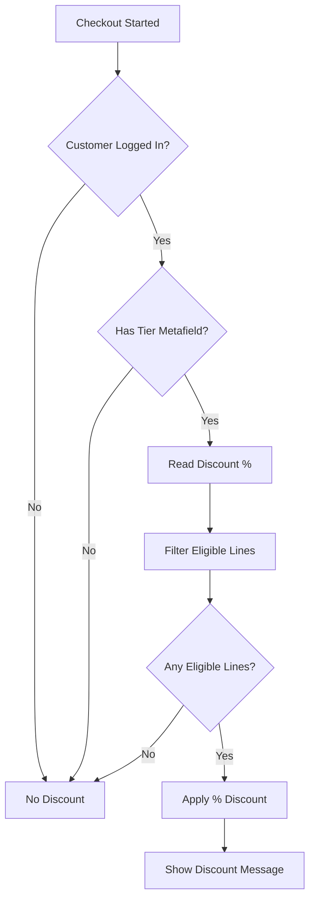

# TradeUp Tier-Based Discount Function

A Shopify Function that automatically applies membership tier discounts at checkout for TradeUp customers.

## Overview

This function reads customer metafields to determine their membership tier and applies the corresponding discount percentage to eligible products at checkout.

## Features

- **Automatic Tier Detection**: Reads tier data from customer metafields
- **Percentage Discounts**: Applies tier-specific percentage discounts (e.g., Gold = 10% off)
- **Product Exclusions**: Respects exclusion tags (`no-tier-discount`, `sale`, `clearance`)
- **Free Shipping Indicator**: Shows free shipping eligibility in discount message
- **Clear Messaging**: Customer-friendly discount titles (e.g., "Gold Member 10% Off")

## Metafield Schema

Customer metafields under the `tradeup` namespace:

| Key | Type | Description | Example |
|-----|------|-------------|---------|
| `tier` | string | Tier name | "GOLD" |
| `tier_discount_pct` | string | Discount percentage | "10" |
| `free_shipping_threshold` | string | Order amount for free shipping (0 = always free) | "50.00" |

## Tier Examples

| Tier | Discount | Free Shipping |
|------|----------|---------------|
| Bronze | 5% | $100+ orders |
| Silver | 7% | $75+ orders |
| Gold | 10% | $50+ orders |
| Platinum | 15% | All orders |

## Installation

### Prerequisites

- Node.js 18+
- Shopify CLI 3.x
- Access to Shopify Partner Dashboard

### Setup

```bash
# Install dependencies
cd extensions/tier-discount-function
npm install

# Generate types from GraphQL
npm run typegen

# Build the function
npm run build

# Run tests
npm test
```

### Deploy

The function is deployed automatically with the TradeUp app:

```bash
# From project root
shopify app deploy
```

## Configuration

After deployment, create a discount in the Shopify admin:

1. Go to **Discounts** > **Create discount**
2. Select **TradeUp Tier Discounts** under "App discounts"
3. Configure the discount name and active dates
4. Save and enable

The function will automatically apply to customers with valid tier metafields.

## Excluded Products

Products with any of these tags are excluded from tier discounts:

- `no-tier-discount` - Explicitly excluded products
- `sale` - Already discounted items
- `clearance` - Clearance items

## How It Works



## Performance

Shopify Functions have strict limits:

- **Execution time**: 5ms maximum
- **Memory**: 256KB maximum
- **Output size**: 64KB maximum

This function is optimized for these constraints:
- Early returns for common no-op cases
- Minimal object allocations
- Integer math where possible
- No external API calls

## Testing

```bash
# Run all tests
npm test

# Run tests in watch mode
npm run test:watch

# Preview function output
npm run preview
```

## Troubleshooting

### Discount Not Applying

1. **Check customer metafields**: Ensure the customer has valid `tradeup.tier` and `tradeup.tier_discount_pct` metafields
2. **Verify discount is active**: Check that the discount in Shopify admin is enabled and within valid dates
3. **Check product tags**: Products tagged with exclusion tags won't receive the discount
4. **Review logs**: Use `shopify app function log` to view function execution logs

### Invalid Discount Amount

The function validates discount percentages:
- Must be a valid number
- Must be between 0 and 100 (exclusive of 0, inclusive of 100)
- Invalid values result in 0% discount (no discount applied)

## API Reference

### Input Query

The function requests the following data from Shopify:

```graphql
query Input {
  cart {
    buyerIdentity {
      customer {
        metafield(namespace: "tradeup", key: "tier") { value }
        metafield(namespace: "tradeup", key: "tier_discount_pct") { value }
        metafield(namespace: "tradeup", key: "free_shipping_threshold") { value }
      }
    }
    lines {
      id
      merchandise {
        ... on ProductVariant {
          product { hasAnyTag(tags: ["no-tier-discount", "sale", "clearance"]) }
        }
      }
      cost { totalAmount { amount } }
    }
  }
}
```

### Output

```json
{
  "discounts": [
    {
      "targets": [
        { "cartLine": { "id": "gid://shopify/CartLine/123" } }
      ],
      "value": {
        "percentage": { "value": "10" }
      },
      "message": "Gold Member 10% Off"
    }
  ]
}
```

## Contributing

1. Make changes to `src/run.js`
2. Update tests in `src/run.test.js`
3. Run `npm test` to verify
4. Build with `npm run build`
5. Test locally with `npm run preview`

## License

Proprietary - Cardflow Labs
